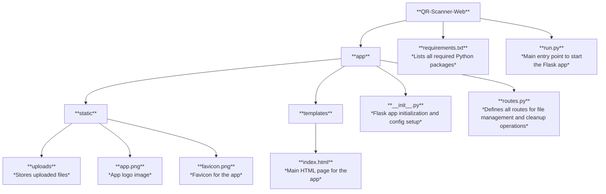

# QR File Sharing

QR File Sharing is a simple web application for uploading files, generating unique QR codes, and sharing download links. It includes automatic file cleanup for old files and supports manual file deletion via API.

## Features

- **File Upload**: Users can upload files which will be stored on the server.
- **QR Code Generation**: A unique QR code is generated for each uploaded file, offering an easy way to share the download link.
- **Automatic File Cleanup**: Files older than 7 days are automatically deleted every day by the background scheduler.(Under Developement but working feature)
- **Manual File Deletion**: Users can delete specific files via an API endpoint.

## Project Structure



## Installation

1. Clone the repository:
    ```bash
    git clone https://github.com/ahansardar/QR-File-Sharing.git
    cd qr-scanner-web
    ```

2. Install the dependencies:
    ```bash
    pip install -r requirements.txt
    ```

3. Run the application:
    ```bash
    python run.py
    ```

4. Visit `http://127.0.0.1:5000/` or the other one in your web browser to use the application.

## Dependencies

The project requires the following Python libraries:

- **Flask**: `Flask==2.3.2`
- **Werkzeug**: `Werkzeug==2.3.2`
- **APScheduler**: `apscheduler==3.9.1`
- **QRCode**: `qrcode==7.3.1`

Install all dependencies with:
```bash
pip install -r requirements.txt
```
## API Endpoints

GET /
Displays the main page where users can upload files.

POST /upload
Uploads a file and generates a QR code with the download link.

Request:
Multipart form data with a file field.

Response:
JSON with a success message, download link, and QR code image URL.
GET /download/<filename>
Downloads a file by its filename.

Request:
Provide the filename in the URL.

Response:
The file is served for download.
POST /cleanup
Triggers manual file cleanup. Deletes files older than 7 days.

Request:
POST request with no body.

Response:
JSON confirming the cleanup execution.
DELETE /delete/<filename>
Deletes a specific file and its corresponding QR code.

Request:
DELETE request with the filename in the URL.

Response:
JSON confirming whether the file was deleted successfully or not.

## How it Works
File Upload: Users upload a file using the /upload endpoint, and the file is saved to the static/uploads directory. A unique QR code is generated for the file's download link.
QR Code Generation: When a file is uploaded, a QR code is created that links to the file's download URL.

File Cleanup: The background scheduler automatically runs the cleanup every day, deleting files older than 7 days.

Manual Cleanup: You can manually trigger the cleanup by sending a POST request to /cleanup.

File Deletion: Files can be deleted by sending a DELETE request to /delete/<filename>.

## License
This project is licensed under the MIT License - see the [LICENSE](https://github.com/ahansardar/QR-File-Sharing/blob/main/LICENSE) file for details.


